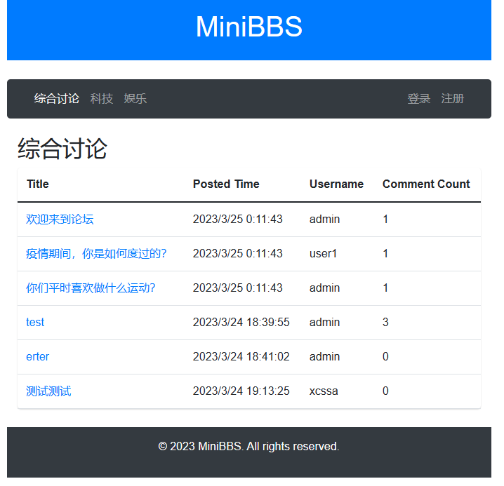
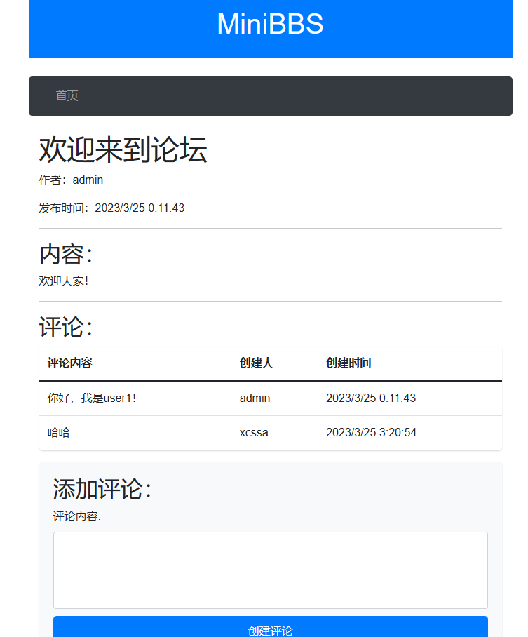
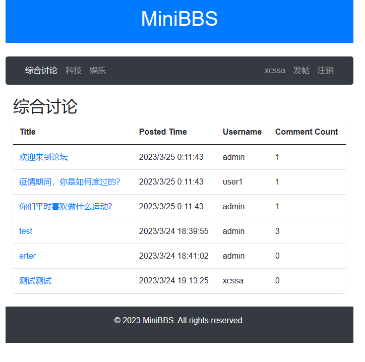
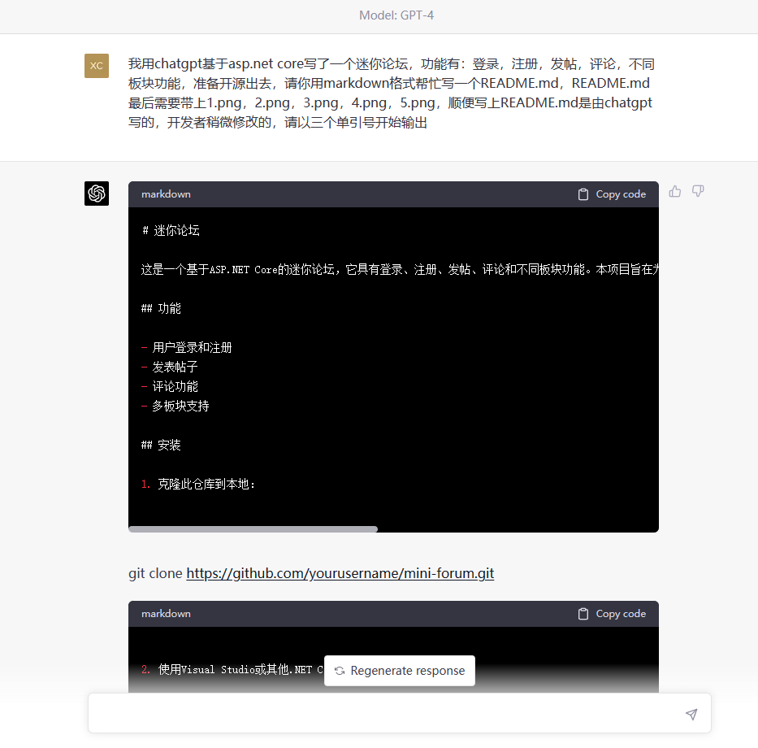
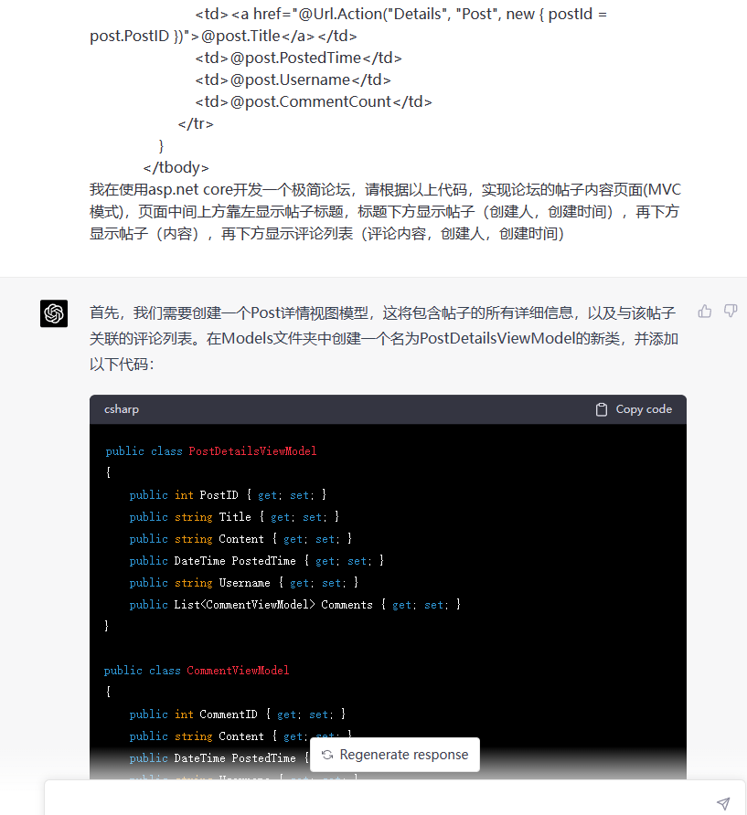
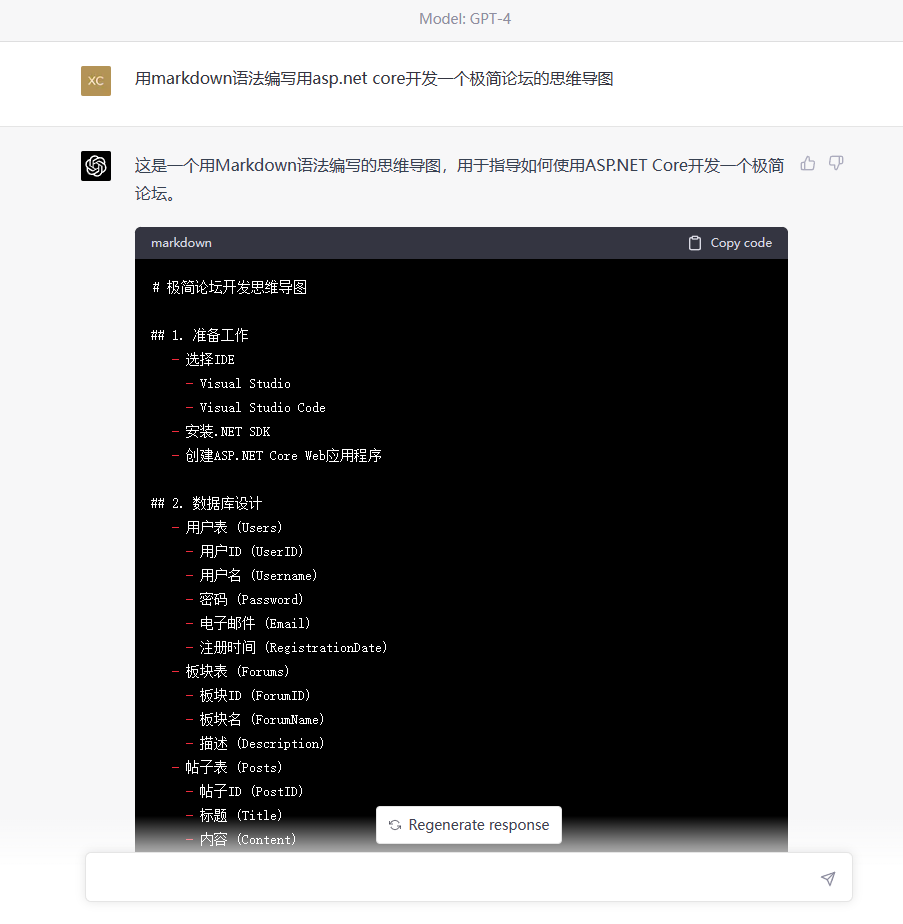
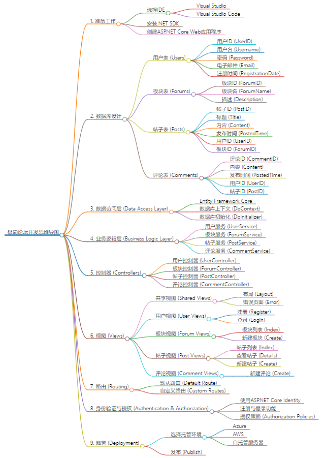

[中文](README.ZH.md)

# MiniBBS

MiniBBS is a lightweight forum built with ASP.NET Core. It provides a simple example for beginners and can also serve as the base for more complex applications.

## Features

- User registration and login
- Create posts
- Comment on posts
- Role based access (regular users and administrators)
- Multiple forums/boards

## Installation

1. Clone the repository:

   ```bash
   git clone https://github.com/imxcstar/MiniBBS
   ```

2. Restore dependencies:

   ```bash
   dotnet restore
   ```

3. Build and run the application:

   ```bash
   dotnet run --project MiniBBS
   ```

4. Visit `https://localhost:7068` in your browser.

## Contributing

Contributions are welcome. Feel free to open issues or submit pull requests.

## License

This project is released under the MIT License. See the [LICENSE](LICENSE.txt) file for details.

## Credits

Most of the code and original Chinese documentation were generated with the help of [ChatGPT](https://openai.com/product/gpt-4).

## Preview








